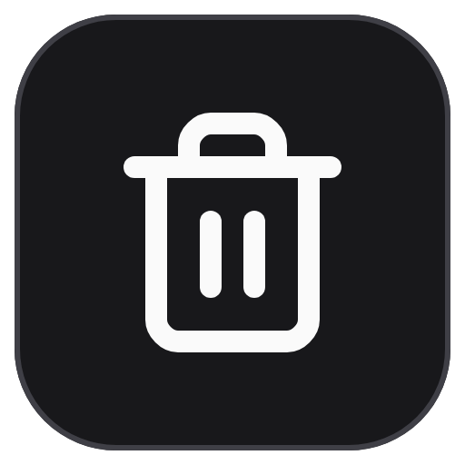
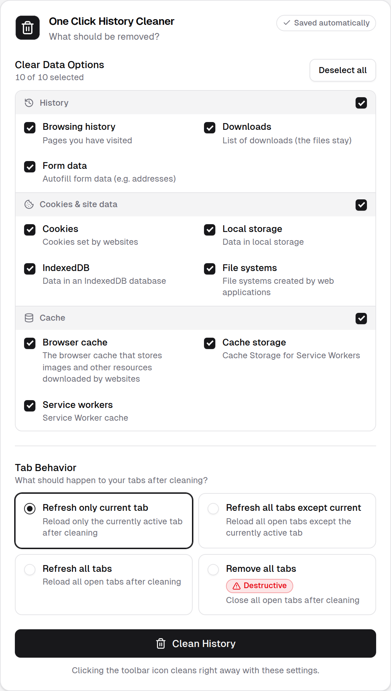

<div align="center">



# One Click History Cleaner

**Your browsing data, gone with one click.**<br>
Choose once what should be removed. From then on, one click on the toolbar icon is all it takes.

[](https://chromewebstore.google.com/detail/one-click-history-cleaner/kcjbahochamceejpgjkniopafgdhkplb)
[](https://chromewebstore.google.com/detail/one-click-history-cleaner/kcjbahochamceejpgjkniopafgdhkplb)
[](https://addons.mozilla.org/firefox/addon/one-click-history-cleaner/)
[](https://addons.mozilla.org/firefox/addon/one-click-history-cleaner/)
[](LICENSE)
[](https://github.com/firsttris/oneclickhistorycleaner/actions/workflows/check_build.yml)

<a href="https://chromewebstore.google.com/detail/one-click-history-cleaner/kcjbahochamceejpgjkniopafgdhkplb"></a>
<a href="https://addons.mozilla.org/firefox/addon/one-click-history-cleaner/"></a>
<a href="https://microsoftedge.microsoft.com/addons/detail/one-click-history-cleaner/paknkcelopbilnnlolmaigecfhpgooma"></a>

</div>

<br>

<p align="center">
  <picture>
    <source media="(prefers-color-scheme: dark)" srcset="store-assets/screenshots/options-dark.png" />
    
  </picture>
</p>

## Why One Click History Cleaner?

Your browser's own "Clear browsing data" dialog asks the same questions every time. This extension remembers your answers. Pick what you want gone, and from then on a single click on the toolbar icon removes it, reloads or closes your tabs the way you like, and tells you when it's done.

- **One click.** No menus, no dialog, no confirmation.
- **You decide what goes.** Ten data types, from history and cookies to cache and IndexedDB, each with its own checkbox.
- **Tabs the way you want.** Reload the current tab, all tabs, all but the current one, or close every tab for a clean start.
- **Settings follow you.** Changes save instantly and sync with your browser account.
- **Private by design.** No tracking, no data collection, no access to the websites you visit. All of the code is open source.
- **Light and dark.** The settings page follows your system theme.

## How it works

1. **Install** the extension from the [Chrome Web Store](https://chromewebstore.google.com/detail/one-click-history-cleaner/kcjbahochamceejpgjkniopafgdhkplb), [Firefox Add-ons](https://addons.mozilla.org/firefox/addon/one-click-history-cleaner/) or [Edge Add-ons](https://microsoftedge.microsoft.com/addons/detail/one-click-history-cleaner/paknkcelopbilnnlolmaigecfhpgooma).
2. **Pin it** to your toolbar so the icon is always in reach.
3. **Click the icon.** Your browsing data is removed right away. Everything is selected by default.

To change what gets removed, right-click the icon and choose **Options**.

## What can be cleaned

| Group | Data type | What it is | Chrome / Edge | Firefox |
|-------|-----------|------------|:-------------:|:-------:|
| History | **Browsing history** | Pages you have visited | ✅ | ✅ |
| | **Downloads** | The list of downloads (the files themselves stay) | ✅ | ✅ |
| | **Form data** | Autofill entries such as addresses | ✅ | ✅ |
| Cookies & site data | **Cookies** | Cookies set by websites | ✅ | ✅ |
| | **Local storage** | Data websites store in your browser | ✅ | ✅ |
| | **IndexedDB** | Databases created by websites | ✅ | ✅ |
| | **File systems** | Files created by web apps | ✅ | ❌ |
| Cache | **Browser cache** | Images, scripts and other downloaded resources | ✅ | ✅ |
| | **Cache storage** | Caches used by service workers | ✅ | ❌ |
| | **Service workers** | Registered service workers | ✅ | ✅ |

Saved passwords, bookmarks and extensions are never touched.

> [!NOTE]
> Firefox doesn't let extensions remove every kind of site storage, so the data types marked ❌ are hidden there. The *Cookies and Site Data* size in Firefox's own *Clear Recent History* dialog (`Ctrl+Shift+Del`) may therefore not drop to exactly zero.

## Privacy

One Click History Cleaner runs entirely on your device. It sends nothing anywhere and collects no data. It only asks for the permissions it needs:

| Permission | Why it is needed |
|------------|------------------|
| `browsingData` | Remove the data types you selected |
| `storage` | Save and sync your settings |
| `notifications` | Show a short "cleaning" and "done" message |

It does not request access to the websites you visit.

## FAQ

<details>
<summary><b>Can I undo a cleaning?</b></summary>
<br>
No. Removed data is gone for good, just like with the browser's own dialog. If you want to keep your history, untick <b>Browsing history</b> in the options.
</details>

<details>
<summary><b>Will I be logged out of websites?</b></summary>
<br>
Yes, if <b>Cookies</b> is selected, because that is where websites keep your login. Untick it to stay logged in.
</details>

<details>
<summary><b>Does it close my tabs?</b></summary>
<br>
Only if you choose <b>Remove all tabs</b>. By default, it reloads just the current tab.
</details>

<details>
<summary><b>Does it clean on its own, for example when the browser closes?</b></summary>
<br>
No. It only cleans when you click the icon or the <b>Clean History</b> button on the options page.
</details>

## Contributing

Bug reports, ideas and pull requests are welcome. [Open an issue](https://github.com/firsttris/oneclickhistorycleaner/issues) to report a problem or suggest a feature.

The extension is built with [SolidJS](https://www.solidjs.com), [TypeScript](https://www.typescriptlang.org), [Tailwind CSS](https://tailwindcss.com) and [Vite](https://vite.dev). The settings page uses components in the style of [shadcn/ui](https://ui.shadcn.com).

### Development

You need Node.js 22.12 or newer (see `.nvmrc`) and npm.

```bash
git clone https://github.com/firsttris/oneclickhistorycleaner.git
cd oneclickhistorycleaner
npm install

npm run start          # Development build for Chrome with hot reload
npm run build          # Production build for Chrome and Edge
npm run build:firefox  # Production build for Firefox
npm run lint           # Biome
npm run typecheck      # TypeScript
```

**Load the extension in Chrome or Edge:** open `chrome://extensions` (or `edge://extensions`), turn on **Developer mode**, click **Load unpacked** and select the `dist` folder.

**Load the extension in Firefox:** run `npm run build:firefox`, open `about:debugging`, click **This Firefox**, then **Load Temporary Add-on…** and select `dist/manifest.json`.

### Publishing

<details>
<summary><b>How releases and store uploads work</b></summary>
<br>

A release is a tag `vX.Y.Z`, as in the other projects ([firsttris/workflows](https://github.com/firsttris/workflows)):

- **Actions → Bump version → Run workflow** (patch, minor or major) raises the version in `package.json`, commits it as `Release vX.Y.Z`, tags it and starts the release. On a checkout, `npm run release:patch` (or `:minor`, `:major`) does the same.
- The tag starts **Release**: lint, typecheck and tests, the Chrome and Firefox builds, then a GitHub release with generated notes and both packages, then the store uploads in parallel.
- To submit an existing version again, e.g. to one store only, run **Release** by hand on its tag and untick the other stores.

```bash
gh workflow run bump.yml -f bump=minor                   # new release, all stores
gh workflow run release.yml --ref v0.1.25 -f edge=false  # existing release, again without Edge
```

The store listing material (banners, description text, icon, screenshots) lives in `store-assets/`, outside `public/`, so it is not packaged into the extension.

The Chrome package is uploaded as a draft (`publish: false`) and has to be submitted for review in the developer dashboard. Firefox receives the source archive of the tagged commit for the review.

**Chrome Web Store** secrets (see [chrome-webstore-upload-keys](https://github.com/fregante/chrome-webstore-upload-keys)): `CHROME_EXTENSION_ID`, `CHROME_CLIENT_ID`, `CHROME_CLIENT_SECRET`, `CHROME_REFRESH_TOKEN`. The publisher ID is not secret and is set in the workflow; it is part of the developer dashboard URL (`https://chrome.google.com/webstore/devconsole/<publisher-id>`).

**Mozilla Add-ons** ([API keys](https://addons.mozilla.org/developers/addon/api/key/)): `AMO_JWT_ISSUER`, `AMO_JWT_SECRET`.

**Microsoft Edge Add-ons** ([Publish API](https://partner.microsoft.com/dashboard/microsoftedge/publishapi)): `EDGE_PRODUCT_ID`, `EDGE_CLIENT_ID`, `EDGE_API_KEY`.

</details>

---

<div align="center">

⭐ Like One Click History Cleaner? A [star on GitHub](https://github.com/firsttris/oneclickhistorycleaner) helps others find it.<br>
🐛 [Report a bug](https://github.com/firsttris/oneclickhistorycleaner/issues/new) · 💡 [Request a feature](https://github.com/firsttris/oneclickhistorycleaner/issues/new)

<sub>License: <a href="LICENSE">GPL-3.0</a> · © Tristan Teufel and contributors<br>
Changed versions you pass on must stay under the GPL and come with their source code; a commercial license without these obligations is available via <a href="https://teufel-it.de">teufel-it.de</a>.</sub>

</div>
