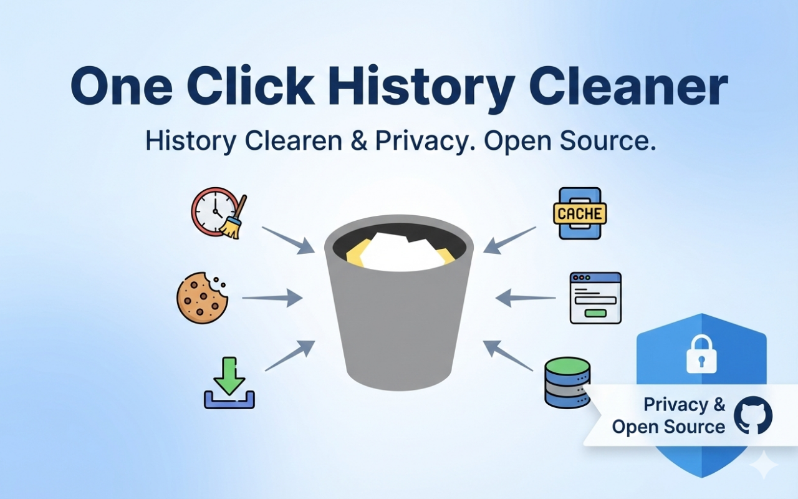

<div align="center">

  # One Click History Cleaner
  

  [](https://github.com/firsttris/oneclickhistorycleaner/actions/workflows/check_build.yml)
  [](https://chromewebstore.google.com/detail/one-click-history-cleaner/kcjbahochamceejpgjkniopafgdhkplb)
  [](https://chromewebstore.google.com/detail/one-click-history-cleaner/kcjbahochamceejpgjkniopafgdhkplb)
  [](https://addons.mozilla.org/en-US/firefox/addon/one-click-history-cleaner/)
  [](https://addons.mozilla.org/en-US/firefox/addon/one-click-history-cleaner/)

  Clean your browsing data with a single click - Simple, fast, and open source.
</div>

## ✨ Features

- 🚀 **One-Click Cleaning** - Click the toolbar icon and your browsing data is gone
- ⚙️ **Fully Customizable** - Choose exactly which data types are removed
- 🔄 **Tab Behavior** - Reload the current tab, all tabs, or close all tabs after cleaning
- 💾 **Auto-Save** - Settings are saved instantly and synced with your browser account
- 🌙 **Dark Mode** - The options page follows your system theme
- 🔒 **Privacy-Focused** - No data collection, fully open source

## 📦 Installation
<div align="center">

### Chrome Web Store
[](https://chromewebstore.google.com/detail/one-click-history-cleaner/kcjbahochamceejpgjkniopafgdhkplb)

### Mozilla Add-ons
[](https://addons.mozilla.org/en-US/firefox/addon/one-click-history-cleaner/)

### Microsoft Edge Add-ons
[](https://microsoftedge.microsoft.com/addons/detail/one-click-history-cleaner/paknkcelopbilnnlolmaigecfhpgooma)
</div>

## 🧹 What Can Be Cleaned?

Open the extension's options to choose what is removed when you click the icon. Everything is selected by default.

| Data Type | Description | Chrome / Edge | Firefox |
|-----------|-------------|:-------------:|:-------:|
| **Cache** | Browser cache (images, scripts and other resources) | ✅ | ✅ |
| **Cache Storage** | Cache Storage used by Service Workers | ✅ | ❌ |
| **Cookies** | Cookies set by websites | ✅ | ✅ |
| **Downloads** | Download history (not the files) | ✅ | ✅ |
| **File Systems** | File systems created by web applications | ✅ | ❌ |
| **Form Data** | Autofill form data (e.g. addresses) | ✅ | ✅ |
| **History** | Browsing history | ✅ | ✅ |
| **IndexedDB** | IndexedDB databases | ✅ | ✅ |
| **Local Storage** | Local storage data | ✅ | ✅ |
| **Service Workers** | Registered Service Workers | ✅ | ✅ |

> [!NOTE]
> Firefox doesn't allow extensions to remove every kind of site storage, so data types marked ❌ are hidden there. The *Cookies and Site Data* size shown in Firefox's own *Clear Recent History* dialog (`Ctrl+Shift+Del`) may therefore not drop to exactly zero.

## 🔐 Permissions

| Permission | Why it is needed |
|------------|------------------|
| `browsingData` | Remove the selected browsing data |
| `storage` | Save your settings |
| `notifications` | Show a short "cleaning / done" notification |

The extension does not request access to the websites you visit.

## 🛠️ Tech Stack

<table>
<tr>
<td align="center" width="150">

<br>TypeScript
</td>
<td align="center" width="150">

<br>Solid.js
</td>
<td align="center" width="150">

<br>Vite
</td>
<td align="center" width="150">

<br>Tailwind CSS
</td>
</tr>
</table>

## 💻 Development

### Prerequisites

- Node.js 22.12 or higher (see `.nvmrc`)
- npm

### Setup

```bash
# Clone the repository
git clone https://github.com/firsttris/oneclickhistorycleaner.git
cd oneclickhistorycleaner

# Install dependencies
npm install

# Start development server (Chrome, hot reload)
npm run start

# Production builds
npm run build          # Chrome / Edge
npm run build:firefox  # Firefox

# Lint and typecheck
npm run lint
npm run typecheck
```

### Load Extension

**Chrome / Edge:**
1. Open `chrome://extensions/` (or `edge://extensions/`)
2. Enable **Developer mode**
3. Click **Load unpacked**
4. Select the `dist` folder from the project

**Firefox:**
1. Run `npm run build:firefox`
2. Open Firefox and navigate to `about:debugging`
3. Click **This Firefox**
4. Click **Load Temporary Add-on...**
5. Select the `manifest.json` in the `dist` folder

The development server hot-reloads the extension in Chrome as you make changes.

## 🔐 Privacy & Security

- **100% Open Source** - All code is available for review
- **No Tracking** - We don't collect any data
- **Local Processing** - Everything runs on your device
- **Transparent Permissions** - Only uses necessary browser APIs

## 🤝 Contributing

Contributions are welcome! Please feel free to submit a Pull Request.

## 📤 Publishing
<details>
<summary><b>How releases and store uploads work</b></summary>

A release is a tag `vX.Y.Z`, as in the other projects ([firsttris/workflows](https://github.com/firsttris/workflows)):

- **Actions → Bump version → Run workflow** (patch, minor or major) raises the version in `package.json`, commits it as `Release vX.Y.Z`, tags it and starts the release. On a checkout, `npm run release:patch` (or `:minor`, `:major`) does the same.
- The tag starts **Release**: lint, typecheck and tests, the Chrome and Firefox builds, then a GitHub release with generated notes and both packages, then the store uploads in parallel.
- To submit an existing version again, e.g. to one store only, run **Release** by hand on its tag and untick the other stores.

```bash
gh workflow run bump.yml -f bump=minor                          # new release, all stores
gh workflow run release.yml --ref v0.1.25 -f edge=false      # existing release, again without Edge
```

The store listing material (banners, description text, 512 px icon) lives in `store-assets/`, outside `public/`, so it is not packaged into the extension.

The Chrome package is uploaded as a draft (`publish: false`) and has to be submitted for review in the developer dashboard. Firefox receives the source archive of the tagged commit for the review.

### Secrets

**Chrome Web Store** (see [chrome-webstore-upload-keys](https://github.com/fregante/chrome-webstore-upload-keys)): `CHROME_EXTENSION_ID`, `CHROME_CLIENT_ID`, `CHROME_CLIENT_SECRET`, `CHROME_REFRESH_TOKEN`. The publisher ID is not secret and is set in the workflow; it is part of the developer dashboard URL (`https://chrome.google.com/webstore/devconsole/<publisher-id>`).

**Mozilla Add-ons** ([API keys](https://addons.mozilla.org/developers/addon/api/key/)): `AMO_JWT_ISSUER`, `AMO_JWT_SECRET`.

**Microsoft Edge Add-ons** ([Publish API](https://partner.microsoft.com/dashboard/microsoftedge/publishapi)): `EDGE_PRODUCT_ID`, `EDGE_CLIENT_ID`, `EDGE_API_KEY`.
</details>

## 📄 License

See the [LICENSE](LICENSE) file for license rights and limitations.

---

<div align="center">

**Made by the open source community**

⭐ Star us on [GitHub](https://github.com/firsttris/oneclickhistorycleaner) • 🐛 [Report a Bug](https://github.com/firsttris/oneclickhistorycleaner/issues) • 💡 [Request a Feature](https://github.com/firsttris/oneclickhistorycleaner/issues)

</div>
